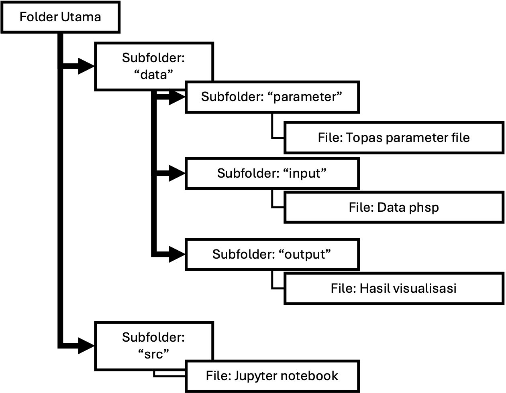

 # Instruksi Manual untuk repositori PhaseSpaceTOPAS-Visualization

 Visualisasi beberapa data phsp TOPAS pada suatu grafik dapat dilakukan dengan menggunakan skrip python yang dikembangkan pada repository ini. 
 Sebagai penjelasan cara penggunaan kode ini, beberapa data phsp telah tersedia sebagai contoh data yang akan divisualkan.

 # Pra-visualisasi (Preparasi Data)

 ## Simulasi Monte Carlo TOPAS
Data phsp diperoleh melalui simulasi terapi proton University of California San Fransisco an Eye Treatment Facility (UCSFETF) di TOPAS.
File parameter untuk menghasilkan data phsp dapat diakses di subfolder [file parameter](https://github.com/alfiafazimah/PhaseSpaceTOPAS-Visualization/tree/main/example%20data/file%20parameter) pada folder [example data](https://github.com/alfiafazimah/PhaseSpaceTOPAS-Visualization/tree/main/example%20data)

 File parameter yang dijalankan adalah `User_BP_R28_PHSP.txt`.
    File parameter ini memuat:
    `UCSF_Beamline_Base.txt`
    `UCSF_DefaultParameters.txt`
    `UCSF_WaterPhamtomPHSP3030.txt`
 Variasi geometri, energi, maupun material komponen pembentuk berkas dapat disesuaikan pada saat menjalankan file parameter tersebut.
 Hasil simulasi berupa data phsp yang terdiri atas file berekstensi `.header` dan `.phsp`

## Data Phsp
Data phsp dari hasil simulasi menjadi input dalam skrip ini.
Sebagai contoh, beberapa data phsp dapat tersedia di subfolder [phsp](https://github.com/alfiafazimah/PhaseSpaceTOPAS-Visualization/tree/main/example%20data/phsp) pada folder [example data](https://github.com/alfiafazimah/PhaseSpaceTOPAS-Visualization/tree/main/example%20data)

## Struktur Folder
Struktur folder untuk menjalankan kode ini adalah sebagai berikut:

Data phsp dan file parameter merupakan file yang disimpan di dalam subfolder yang tersimpan di dalam folder `data`, sedangkan skrip python disimpan di dalam folder `src`.
Jika menggunakan data phsp yang telah tersedia di folder [phsp](https://github.com/alfiafazimah/PhaseSpaceTOPAS-Visualization/tree/main/example%20data/phsp) di repositori ini, maka file tersebut harus disimpan di dalam subfolder `input` pada folder `data`, sesuai dengan struktur folder pada gambar sebelumnya.

Setelah penyesuaian manajemen folder dan file, maka visualisasi dapat dilakukan.

# Visualisasi
Visualisasi dapat dilakukan dengan menjalankan skrip python (jupyter notebook) yang tersedia di folder [src](https://github.com/alfiafazimah/PhaseSpaceTOPAS-Visualization/tree/main/src). 
Hasil visualisasi adalah berupa gambar yang tersimpan di subfolder `output` pada `folder utama` di komputer pengguna.
Sebagai contoh, berikut adalah gambar hasil visualisasi data phsp dengan menggunakan repositori ini.

